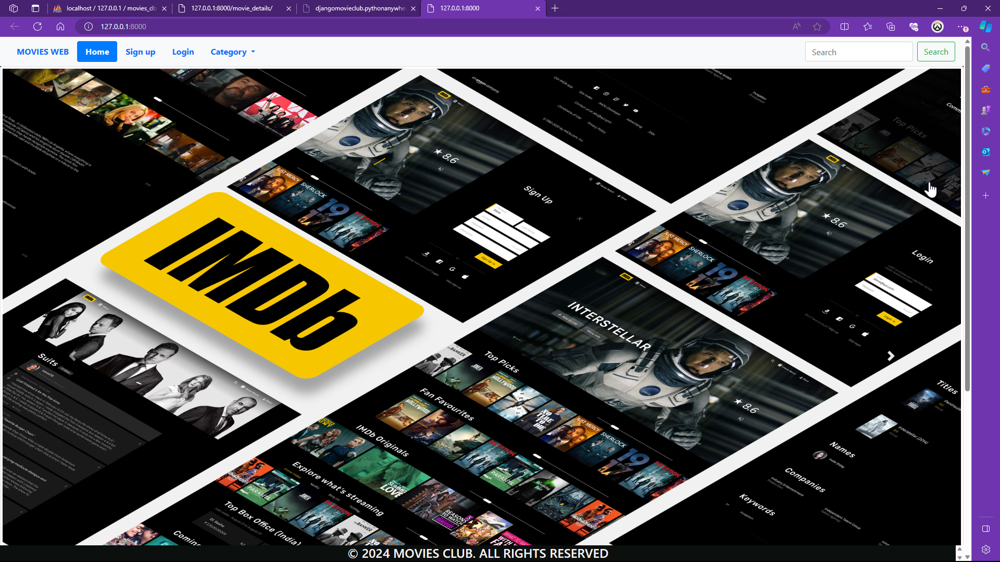
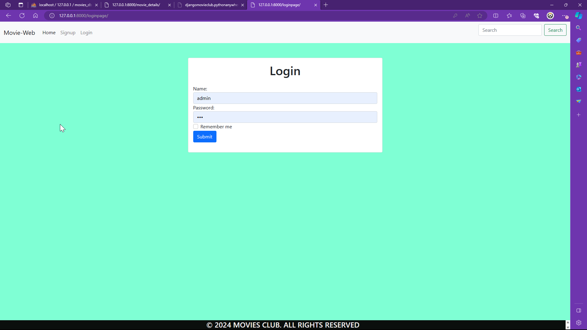
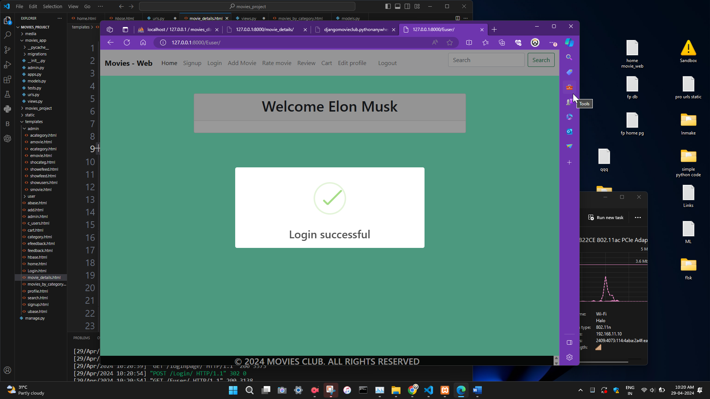
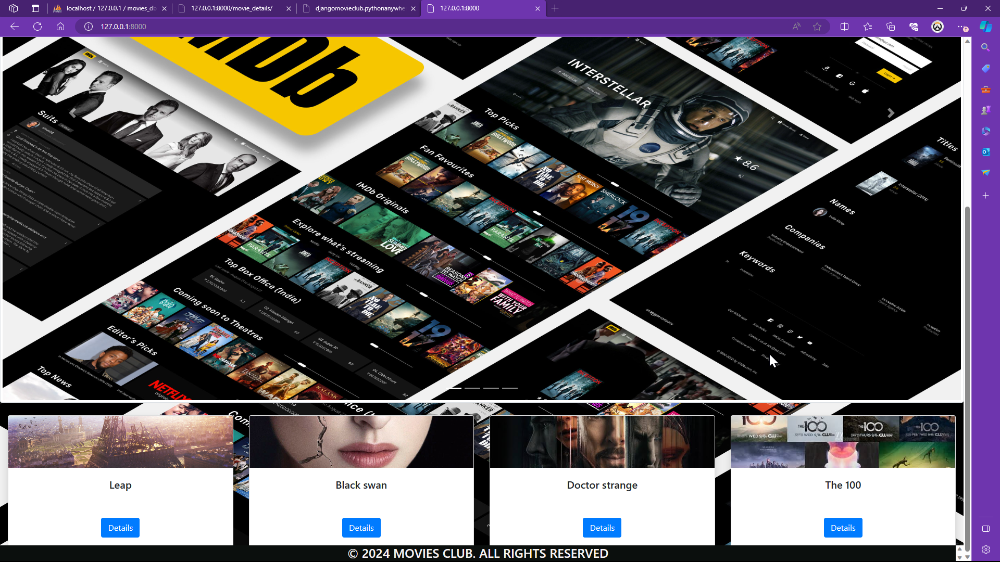
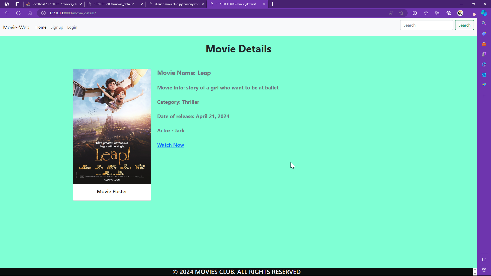
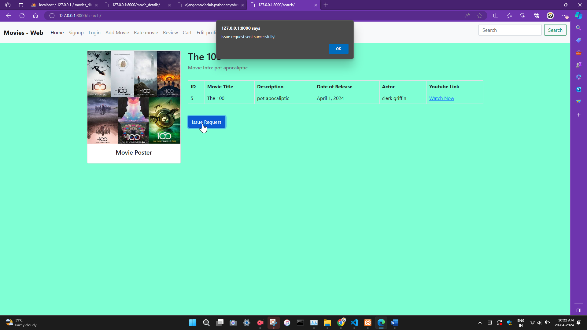
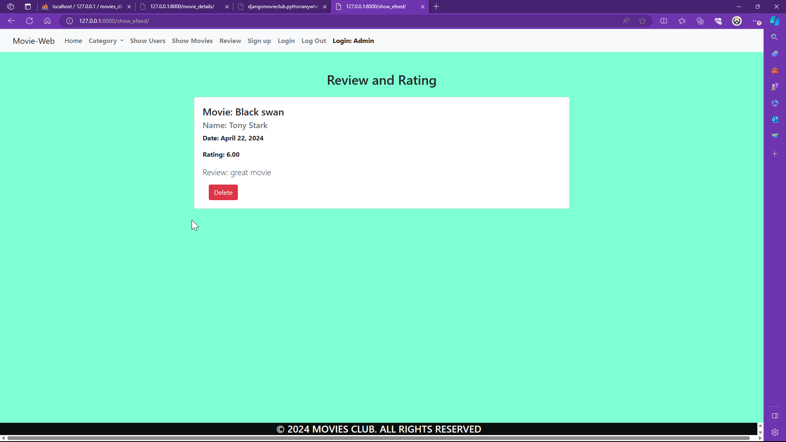
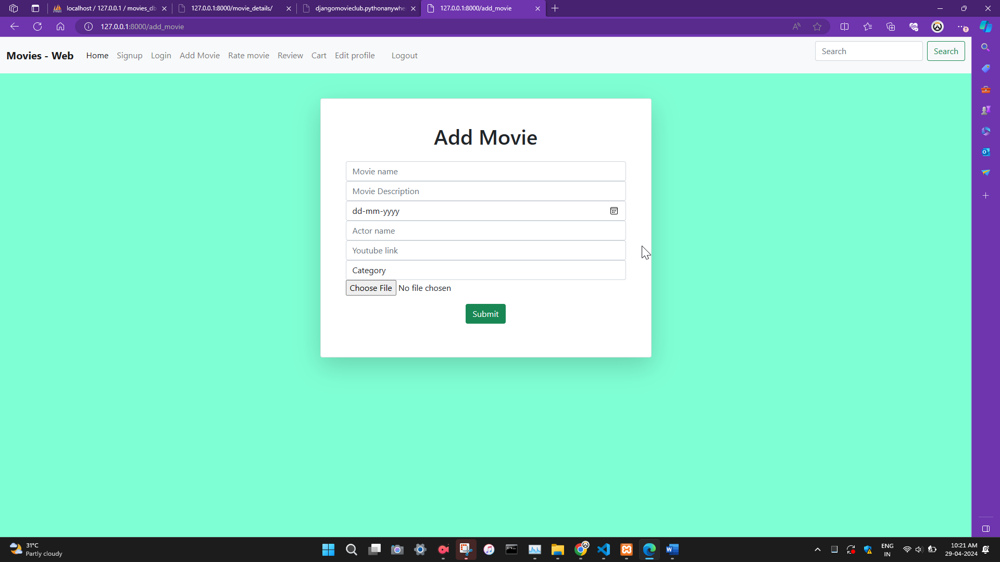
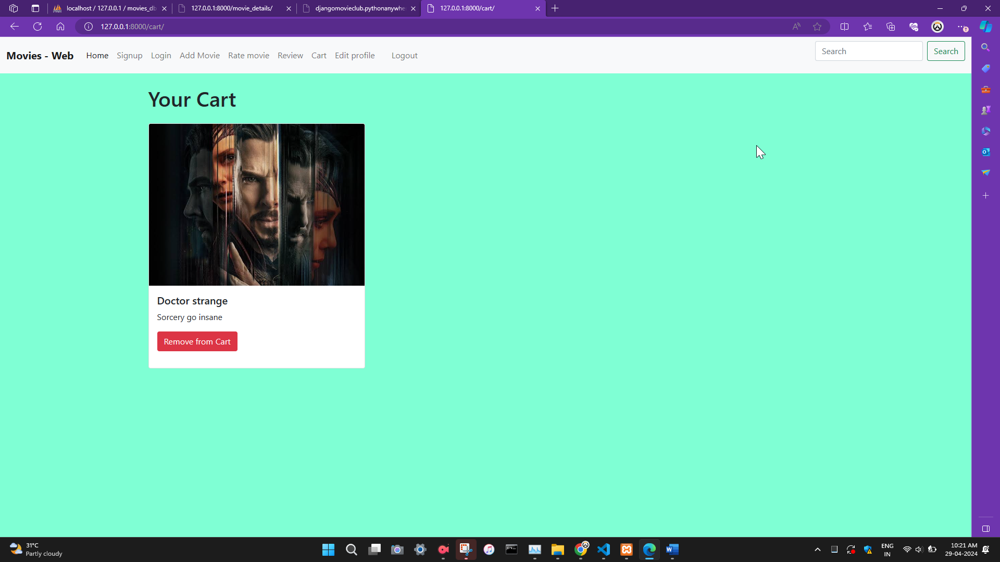

# (Django MAIN PROJECT) E-Commerce Website with Djnago framework
This is a e-commerce website built with Django,Python,HTML,CSS,Bootstrap & Javascript 
host;- http://djangomovieclub.pythonanywhere.com/

Movie Website

This project is a dynamic movie website built using Django, a high-level Python web framework.
The website allows users to browse through a collection of movies, search for specific titles, 
and view details about each movie, including descriptions, release dates, actors, and trailers.
Users can also register, login, and customize their profiles.

Features

User Authentication: Users can sign up, log in, and log out securely.
Browse and Search: Users can browse through a variety of movies and search for specific titles.
Movie Details: Detailed information about each movie, including descriptions, release dates, and trailers.
User Profiles: Registered users can customize their profiles and manage their preferences.
Admin Panel: Administrators have access to an admin panel to manage movies, categories, and user feedback.
Feedback System: Users can leave feedback and ratings for movies.

Technologies Used

Django: Used as the primary web framework for backend development.
HTML/CSS: Frontend design and layout.
JavaScript: Adding interactivity and dynamic features.
SQLite: Database management.(Using sql lite db for easy hosting on pythonanywhere.Project was actually done on mysql ,
if any erorr occure please let me know on comment section)

Movie Web: A Django Project for Movie Management
Movie Web is a comprehensive Django web application designed to manage movies, categories, user reviews, and a shopping cart system. It caters to both administrators and movie enthusiasts, offering functionalities for:

Movie Management (Admin):
Add, edit, and delete movies.
Associate movies with categories.
Manage user-submitted reviews and feedback.
View and manage user accounts.

Movie Search and Browsing (Users):
Search for movies by title or description.
Browse movies by category.
View detailed information about individual movies, including title, description, release date, actors, YouTube trailer, and image.

User Accounts and Reviews:
Register for an account and provide profile information.
Submit reviews and ratings for movies.
View all user reviews (Admin).

Shopping Cart (Future Implementation):
Add movies to a shopping cart (placeholder functionality included).

Key Features:
User authentication and authorization.
Category-based movie organization.
User review and feedback system.
SweetAlert integration for user feedback notifications (success, error).
File upload for movie images (Admin).

Getting Started:
Clone the repository using git clone https://github.com/your-username/movie-web.git.
Install required dependencies using pip install -r requirements.txt.
Configure database settings in codiac_shop/settings.py.
Create database tables using python manage.py migrate.
Run the development server using python manage.py runserver.
